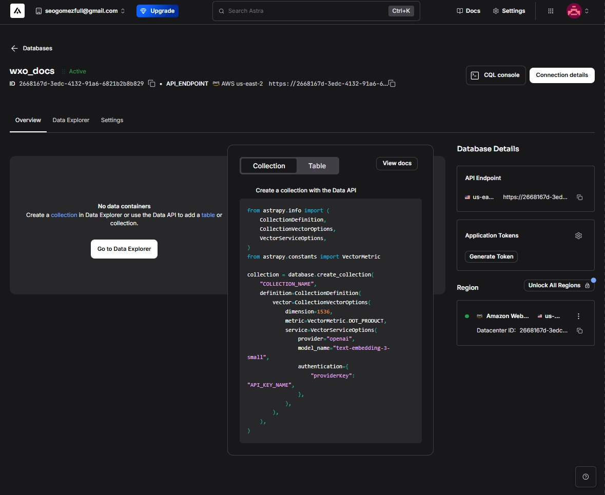
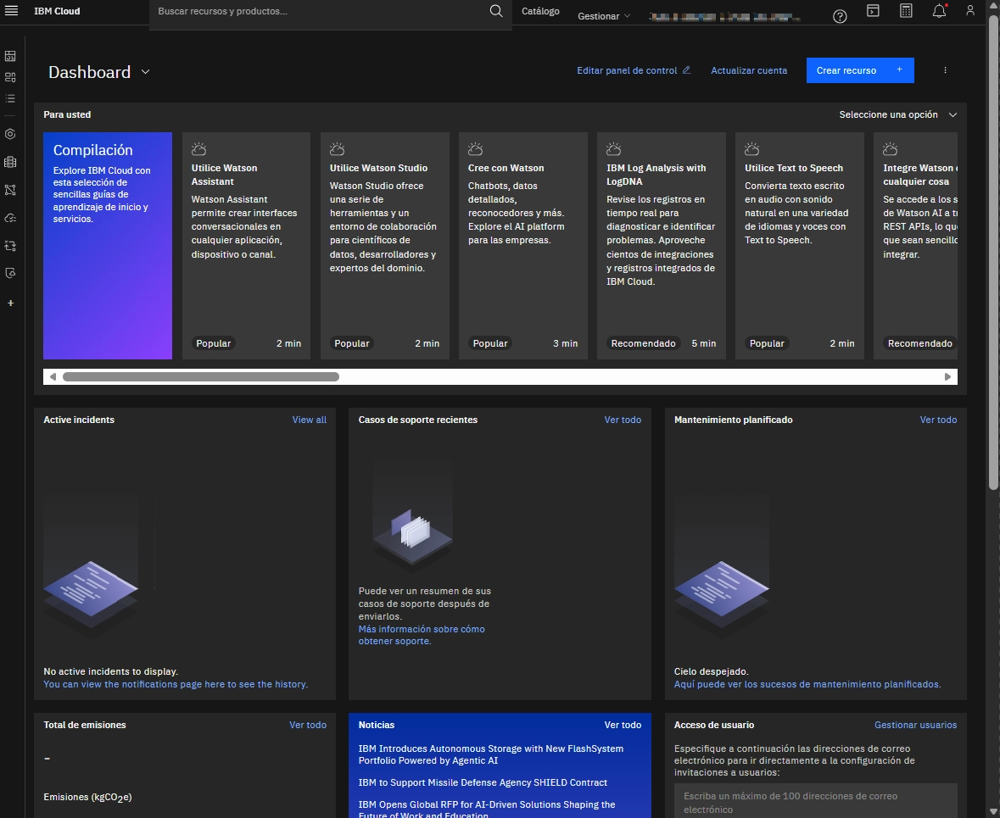

---
layout:
  width: default
  title:
    visible: false
  description:
    visible: false
  tableOfContents:
    visible: true
  outline:
    visible: true
  pagination:
    visible: true
  metadata:
    visible: true
  tags:
    visible: true
---

# Construye un agente GraphRAG usando Orchestrate y AstraDB

## Construye un agente GraphRAG usando Orchestrate y AstraDB

El RAG tradicional opera bajo una lógica de "similitud semántica". Fragmenta el contenido en `chunks` aislados que se transforman en vectores. Cuando lanzas una consulta, el sistema recupera los fragmentos más parecidos, pero lo hace de forma "ciega" a la estructura:

* **Limitación**: Si la respuesta requiere conectar puntos dispersos en diferentes documentos (por ejemplo, relacionar un concepto técnico en el Documento A con su autor en el Documento B), el sistema puede fallar por falta de contexto relacional. Recupera piezas sueltas, no el rompecabezas completo.<br>

**El enfoque relacional: GraphRAG**

GraphRAG potencia la búsqueda vectorial integrando una capa de metadatos relacionales. En lugar de ver documentos aislados, el sistema entiende el conocimiento como una red interconectada:

* **Contexto enriquecido**: Si un documento explica la _Teoría de la Relatividad_, GraphRAG no solo encuentra ese texto, sino que activa los enlaces de metadatos (como "creada por") que lo conectan instantáneamente con la biografía de _Einstein_. Esto permite que el LLM reciba un contexto multidimensional y no solo un retazo de información.<br>

**Implementación: Extracción vs. Estructura existente**

Existen dos caminos para dotar de inteligencia relacional a tus datos:

* **Extracción vía LLM**: Puedes pedirle a un modelo que identifique entidades y cree el grafo. Sin embargo, esto es costoso, lento y propenso a alucinaciones en grandes volúmenes de datos.
* **Uso de enlaces nativos**: Una alternativa mucho más eficiente y escalable es aprovechar la estructura que ya existe. Al procesar los fragmentos, se conservan las URLs y los hipervínculos internos. Esto crea una red de conexiones "naturales" y definiciones cruzadas que el analizador puede mapear fácilmente, ideal para bases de conocimientos dinámicas y extensas (como tu proyecto en Obsidian o documentación técnica).<br>

**Requisitos previos**

Antes de empezar, asegúrate de tener lo siguiente:

* Familiaridad básica con comandos de terminal y comandos bash.
* Habilidades básicas de Python y habilidades generales de programación, incluyendo experiencia con Jupyter Notebooks.
* Una instalación del **Kit de Desarrollo de Agentes Orquestados** (ADK) de Watsonx. Echa un vistazo al tutorial de cómo empezar con ADK si no tienes una instancia activa.
* Acceso a Watsonx Orchestrate. Puedes inscribirte en una [Prueba gratuita de 30 días.](https://www.ibm.com/account/reg/us-en/signup?formid=urx-52753\&utm_source=ibm_developer\&utm_content=in_content_link\&utm_id=tutorials_graphrag-agent-watsonx-orchestrate-astradb\&cm_sp=ibmdev-_-developer-tutorials-_-ibmcom)
* Acceso a watsonx.ai. Puedes inscribirte en una [Prueba gratuita de 30 días](https://eu-de.dataplatform.cloud.ibm.com/registration/stepone?context=wx\&preselect_region=true\&utm_source=ibm_developer\&utm_content=in_content_link\&utm_id=tutorials_graphrag-agent-watsonx-orchestrate-astradb\&cm_sp=ibmdev-_-developer-tutorials-_-trial).

***

<details>

<summary><strong>Configura un Astra DB</strong></summary>

Crea una nueva base de datos. Regístrate para obtener una cuenta gratuita de DataStax en Astra DB en el [DataStax Astra DB](https://astra.datastax.com/signup) portal.<br>

* En el panel de control de Astra DB, haz clic **en Crear base de datos**.
* Tras unos minutos, se creará la base de datos. Anota el **API\_ENDPOINT** porque lo necesitarás más adelante.

<figure><figcaption></figcaption></figure>


Cómo apunte general puedes desplegar la base de dato vectorial empleando la CLI de Astra: `astra db create wxo_docs --region us-east-2 --cloud aws`


**Crear una colección de documentos de Astra DB**<br>

* Haz clic en la pestaña **del Explorador de datos** y **haz clic en Crear Colección**.
* Introduce la información y luego haz clic **en Crear colección**.<br>
  * Nombre de la colección: **wxo\_docs**
  * Colección habilitada por vector: **Sí**
  * Método de generación incrustada: **Bring my own**
  * Dimensiones: **768**
  * Métrica de similitud: **Coseno**

<figure><figcaption></figcaption></figure>

* Haz clic **en Detalles de conexión**.
* Haz **clic en Generar token**.
* Anota el token de solicitud porque lo necesitarás más adelante.

<figure><figcaption></figcaption></figure>


Despliega la colección con Astra CLI: `astra db create-collection wxo_docs --collection wxo_docs --dimension 768 --metric cosine` .


* **`create-collection`**: El comando atómico para la Data API.
* **`wxo_docs`**: El nombre de la base de datos (donde se va a crear).
* **`--collection wxo_docs`**: El nombre que tendrá la colección específica.
* **`--dimension 768`**: El "ancho" del vector de Watsonx.
* **`--metric cosine`**: El algoritmo de búsqueda de similitud.


**Nota**: Astra DB puede generar embeddings automáticamente cuando se cargan documentos, pero en este laboratorio los embeddings se crean con código Python usando un servicio de incrustación watsonx.ai.


</details>

***

<p align="center"><a href="https://github.com/sebastian-gsz/WatsonxOrchestrateGraphRAG/tree/main"><strong>Accede al repositorio</strong></a></p>

***

<details>

<summary><strong>Configura IBM Cloud Watsonx</strong></summary>

* **Selecciona Proyectos → Ver todos los proyectos** desde el menú hamburguesa, haz clic **en Nuevo proyecto**, introduce un nombre, selecciona Almacenamiento de objetos en la nube desde tu cuenta y haz clic **en Crear**.
* Después de crear el proyecto, abre la pestaña **Gestionar**. Anota el ID del proyecto y añade tanto el ID del proyecto como la clave API de la nube de IBM al archivo:`.env`
* Selecciona la pestaña **Servicios e Integraciones** en la navegación y haz clic **en Servicio Asociado**. Elige una instancia de watsonx.ai Runtime para asociarla con el proyecto.
*

<figure><figcaption></figcaption></figure>

* Inicia sesión en IBM Cloud y ve a **Gestionar → Acceso (IAM) → Claves API → Crear** para crear una clave API de IBM Cloud.
* Toma nota de la clave API de IBM Cloud porque la necesitarás más adelante.


<figure><figcaption></figcaption></figure>


Después de crear el proyecto, abre la pestaña **Gestionar**. Anota el ID del proyecto y añade tanto el ID del proyecto como la clave API de la nube de IBM al archivo junto a los demás secretos de Astra: `.env`&#x20;

```
ASTRA_DB_APPLICATION_TOKEN=
ASTRA_DB_API_ENDPOINT=
ASTRA_DB_COLLECTION=
WATSONX_APIKEY=
WATSONX_PROJECT_ID=
```

</details>


